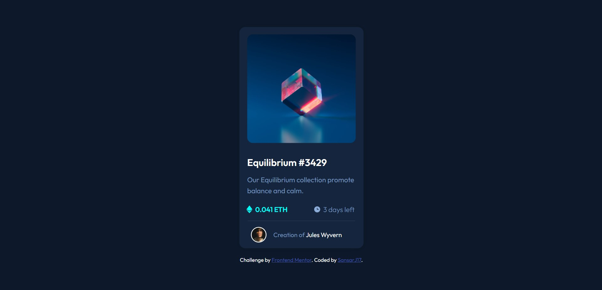
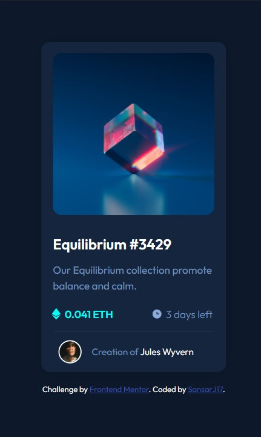

# Frontend Mentor - NFT preview card component solution

This is a solution to the [NFT preview card component challenge on Frontend Mentor](https://www.frontendmentor.io/challenges/nft-preview-card-component-SbdUL_w0U). Frontend Mentor challenges help you improve your coding skills by building realistic projects.

## Table of contents

## Overview

### Screenshot

Desktop View

Desktop View

### Links

- Solution URL: [Solution](https://www.frontendmentor.io/solutions/qr-component-hXg-CjnI7)
- Live Site URL: [Live Site](https://sansarj17.github.io/FM-QrComponent/)

### Built with

- Semantic HTML5 markup
- CSS custom properties
- Flexbox
- Mobile-first workflow

## Author

- Github - [@sansarj17](https://github.com/sansarj17/)
- Frontend Mentor - [@sansarj17](https://www.frontendmentor.io/profile/sansarj17)
